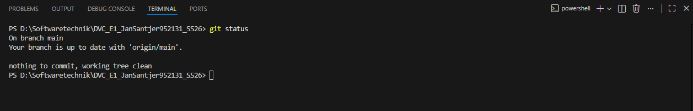
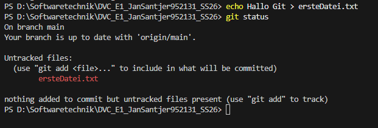
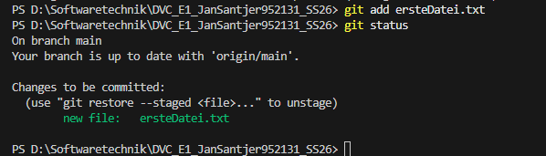
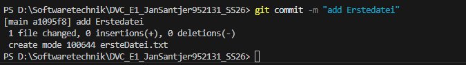
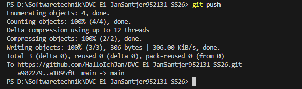
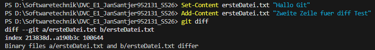
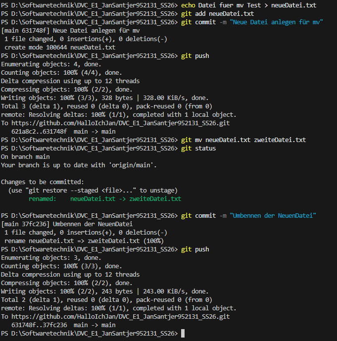
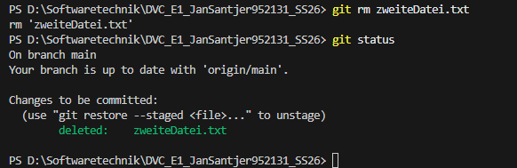

# DVC_E1_Versionskontrolle mit Git

Dies ist mein Repo für die Abgabe der Versionskontrolle (DVC). 

Name: Jan Santjer 
Matrikelnummer: 952131

Repo: https://github.com/HalloIchJan/DVC_E1_JanSantjer952131_SS26

Git Befehle:

# 1. Git Status

Mit dem befehl "git status" überprüft man den aktuellen Zustand des Repos. 

Verwendete Befehle: 
`git status`

## Screenshot 

# 2. Eine neue Datei anlegen

Ich habe eine neue Datei angelegt mit den Namen: "ersteDatei.txt". 
Dies habe ich mit den verwendeten Befehl "echo Hallo Git > ersteDatei.txt" erstellt. Danach habe ich nochmal mit "git status" geprüft ob alles funktioniert hat. 

Verwendete Befehle: 
`echo Hallo Git > ersteDatei.txt`
`git status`

## Screenshot 

# 3. Git Add

Die Datei wurde mit "git add" zur Staging Area hinzugefügt.

Verwendete Befehle: 
`git add ersteDatei.txt`
`git status`

## Screenshot

# 4. Git Commit 

Die Änderungen wurden mit einen Commit  gespeichert. Die Änderungen sind erstmal nur lokal gespeichert. 

Verwendeter Befehl: 
`git commit -m "add Erstedatei"`

## Screenshot

# 5. Git Push 

Die Änderungen wurden in das Repo hochgeladen. 

Verwendeter Befehl: 
`git push`

## Screenshot

# 6. Git Diff

Mit "git diff" wurden Änderungen vor dem Commit angezeigt.

Verwendete Befehle: 
`Set-Content ersteDatei.txt "Hallo Git"`
`Add-Content ersteDatei.txt "Zweite Zeile fuer diff Test"`
`git diff`

## Screenshot

# 7. Git MV 

Um das anschaulicher zu machen habe ich erstmal eine neue Datei angelegt und diese "neueDatei.txt" genannt. 

Verwendete Befehle: 
`echo Datei fuer mv Test > neueDatei.txt`
`git add neueDatei.txt`
`git commit -m "Neue Datei anlegen für mv"`
`git push`
`git mv neueDatei.txt zweiteDatei.txt`
`git status`
`git commit -m "Umbennen der NeuenDatei"`
`git push`

## Screenshot

# 8. Git RM

In diesen Schritt löschen wir die im Schritt 7. neu erstellte und umbenannte Datei wieder aus dem Repo. Das machen wir mit dem Befehl "Git rm". 

Verwendete Befehle: 
`git rm zweiteDatei.txt`
`git status`

## Screenshots

